# C4 Architecture Skill

Create architecture documentation using the C4 model.

## When to Use

- Documenting system architecture
- Onboarding new team members
- Architecture decision records
- Technical design documents

## The C4 Model

```
Level 1: System Context  → Who uses the system? What external systems?
Level 2: Container       → What are the major technical building blocks?
Level 3: Component       → What are the components inside each container?
Level 4: Code            → How is a component implemented? (optional)
```

## Level 1: System Context

Shows the system in scope and its relationships with users and other systems.

```mermaid
flowchart TB
    subgraph External
        User[👤 Customer]
        Admin[👤 Admin]
        Payment[💳 Payment Gateway]
        Email[📧 Email Service]
    end
    
    subgraph System[E-Commerce Platform]
        ECommerce[🛒 E-Commerce System]
    end
    
    User -->|Browse, Purchase| ECommerce
    Admin -->|Manage Products| ECommerce
    ECommerce -->|Process Payments| Payment
    ECommerce -->|Send Notifications| Email
```



### Template

```markdown
## System Context

**System**: [Name]
**Description**: [What it does]

### Users
| Actor | Description | Interactions |
|-------|-------------|--------------|
| Customer | End user | Browse, purchase, track orders |
| Admin | Internal staff | Manage products, view reports |

### External Systems
| System | Description | Integration |
|--------|-------------|-------------|
| Stripe | Payment processing | REST API |
| SendGrid | Email delivery | REST API |
```

## Level 2: Container Diagram

Shows the high-level technical building blocks.

```mermaid
flowchart TB
    subgraph Users
        Web[🌐 Web Browser]
        Mobile[📱 Mobile App]
    end
    
    subgraph Platform[E-Commerce Platform]
        SPA[React SPA<br/>TypeScript]
        API[API Gateway<br/>Node.js]
        Auth[Auth Service<br/>Node.js]
        Orders[Order Service<br/>Node.js]
        Products[Product Service<br/>Node.js]
        
        subgraph Data
            PG[(PostgreSQL)]
            Redis[(Redis Cache)]
            S3[(S3 Storage)]
        end
        
        subgraph Messaging
            NATS[NATS JetStream]
        end
    end
    
    Web --> SPA
    Mobile --> API
    SPA --> API
    
    API --> Auth
    API --> Orders
    API --> Products
    
    Auth --> PG
    Auth --> Redis
    Orders --> PG
    Orders --> NATS
    Products --> PG
    Products --> S3
```



### Template

```markdown
## Container Diagram

### Containers
| Container | Technology | Purpose |
|-----------|------------|---------|
| Web App | React, TypeScript | Customer-facing SPA |
| API Gateway | Node.js, Express | Route requests, auth |
| Order Service | Node.js | Order management |
| Product Service | Node.js | Product catalog |
| PostgreSQL | PostgreSQL 15 | Primary data store |
| Redis | Redis 7 | Caching, sessions |
| NATS | JetStream | Event messaging |

### Communication
| From | To | Protocol | Purpose |
|------|-----|----------|---------|
| Web App | API Gateway | HTTPS | All API calls |
| API Gateway | Services | gRPC | Internal calls |
| Services | NATS | NATS | Async events |
```

## Level 3: Component Diagram

Shows components within a container.


### Template

```markdown
## Component Diagram: Order Service

### Components
| Component | Responsibility |
|-----------|----------------|
| OrderController | HTTP request handling, validation |
| OrderService | Business logic, orchestration |
| OrderRepository | Database operations |
| EventPublisher | Publish domain events |
| PaymentClient | External payment integration |

### Dependencies
| Component | Depends On | Purpose |
|-----------|------------|---------|
| OrderService | OrderRepository | Persist orders |
| OrderService | PaymentClient | Process payments |
| OrderService | EventPublisher | Notify other services |
```

## Level 4: Code (Optional)

Class/interface diagrams for critical components.


## Architecture Decision Record (ADR)

```markdown
# ADR-001: Use NATS JetStream for Event Messaging

## Status
Accepted

## Context
We need async communication between services for:
- Order events (created, shipped, delivered)
- Inventory updates
- Notification triggers

## Decision
Use NATS JetStream because:
- Lightweight, high performance
- Built-in persistence
- Simple deployment
- Good TypeScript support

## Consequences
### Positive
- Low latency messaging
- Easy to operate
- Scales well

### Negative
- Less feature-rich than Kafka
- Smaller ecosystem

## Alternatives Considered
- RabbitMQ: More complex, heavier
- Kafka: Overkill for our scale
- Redis Streams: Less durable
```

## Documentation Structure

```
docs/
├── architecture/
│   ├── README.md           # Overview
│   ├── c4-context.md       # Level 1
│   ├── c4-containers.md    # Level 2
│   ├── c4-components/      # Level 3
│   │   ├── order-service.md
│   │   └── product-service.md
│   └── decisions/          # ADRs
│       ├── 001-messaging.md
│       └── 002-database.md
```

## Best Practices

1. **Start with Context** - Always begin at Level 1
2. **Use consistent notation** - Same shapes, colors across diagrams
3. **Keep diagrams updated** - Part of PR process
4. **Link to code** - Reference actual implementations
5. **Include ADRs** - Document why, not just what
