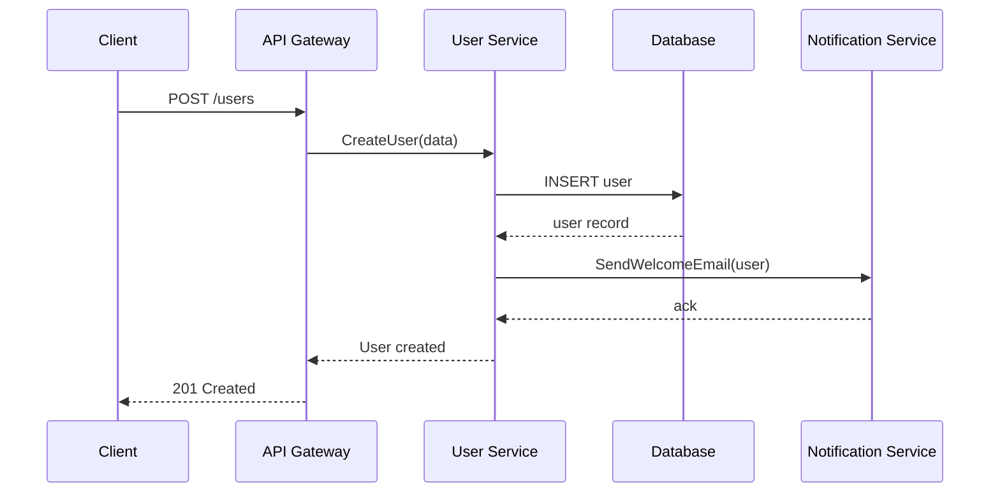
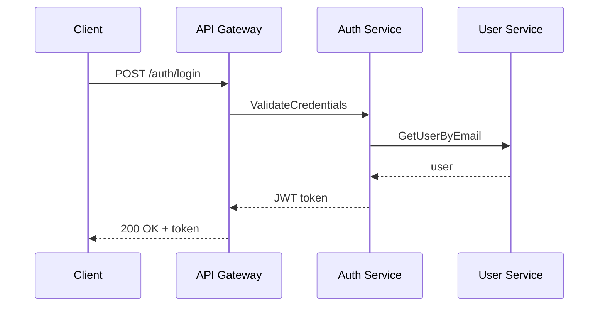
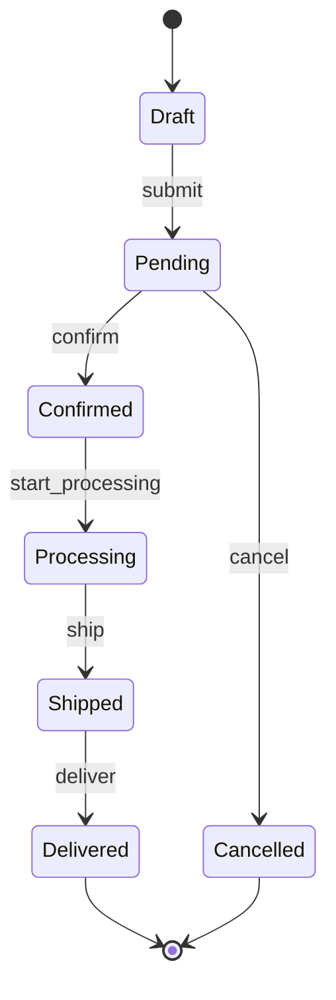
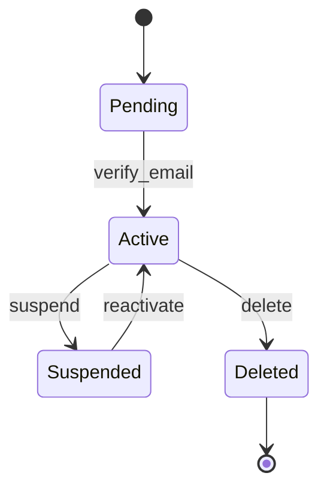
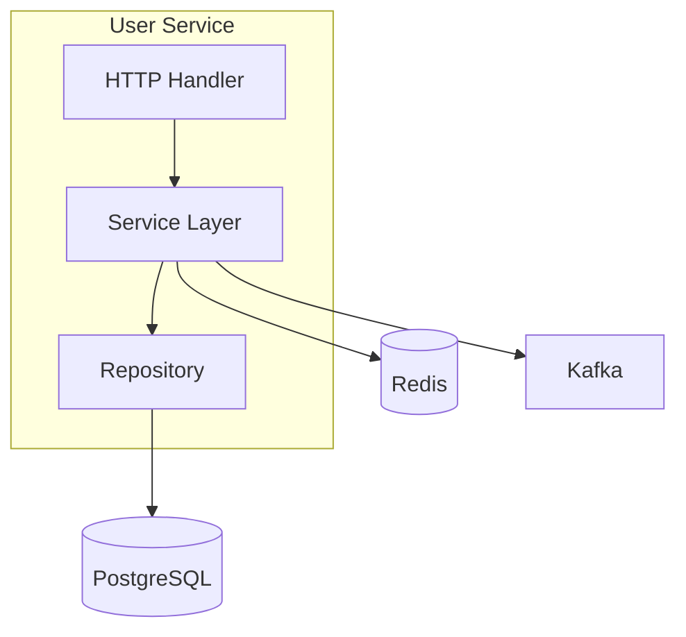
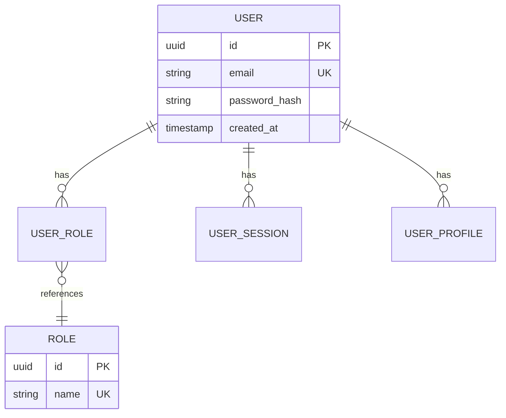

# Service Architecture Extractor

Use this workflow to **extract architecture details** from an existing service project. This is NOT a spec workflow - it analyzes actual code to generate a normalized summary for the Service Registry.

## Usage

```
/service-extract [service_project_path]
```

**Examples:**
- `/service-extract /path/to/user-service`
- `/service-extract .` (current directory)
- `/service-extract --repo=github.com/org/order-service`

## Input

```text
$ARGUMENTS
```

**Options:**
1. **Single service path:** Analyze one service project
   ```
   /service-extract /path/to/user-service
   /service-extract .  # current directory
   ```

2. **Folder of services:** Analyze all services in a folder
   ```
   /service-extract /path/to/services-folder
   ```
   - Will scan the folder for service projects
   - Detects services by looking for: `package.json`, `go.mod`, `Gemfile`, `pubspec.yaml`, etc.
   - Creates individual `docs/service-extract.yaml` for each service
   - Also creates `docs/services-summary.md` with overview of all services

3. **Multiple specific paths:** Analyze multiple services
   ```
   /service-extract /path/to/user-service /path/to/order-service /path/to/payment-service
   ```

**Folder Structure Example:**
```
services/
├── user-service/
│   ├── go.mod
│   ├── main.go
│   └── ...
├── order-service/
│   ├── package.json
│   ├── tsconfig.json
│   └── ...
├── payment-service/
│   ├── Gemfile
│   ├── config/routes.rb
│   └── ...
└── mobile-app/
    ├── pubspec.yaml
    └── ...
```

**Output for folder option:**
```
services/
├── user-service/docs/user-service-service-summary.md
├── user-service/docs/user-service-service-summary.yaml  # optional
├── order-service/docs/order-service-service-summary.md
├── order-service/docs/order-service-service-summary.yaml  # optional
├── payment-service/docs/payment-service-service-summary.md
├── payment-service/docs/payment-service-service-summary.yaml  # optional
├── mobile-app/docs/mobile-app-service-summary.md
├── mobile-app/docs/mobile-app-service-summary.yaml  # optional
└── docs/services-summary.md  # aggregated overview
```

## Prerequisites

The service project should have:
- Source code with identifiable structure
- Package/dependency file (package.json, go.mod, Gemfile, pubspec.yaml, etc.)
- Existing API definitions (OpenAPI, Proto, or code-based routes)

## Detection Strategy

Automatically detect the technology stack by looking for:

| File | Technology |
|------|------------|
| `package.json` + `tsconfig.json` | TypeScript/Node.js |
| `package.json` (no tsconfig) | JavaScript/Node.js |
| `go.mod` | Go |
| `Gemfile` + `config/routes.rb` | Ruby on Rails |
| `pubspec.yaml` | Flutter/Dart |
| `requirements.txt` / `pyproject.toml` | Python |
| `pom.xml` / `build.gradle` | Java/Kotlin |
| `Cargo.toml` | Rust |

## Prompt

```
You are a solutions architect. Extract normalized architecture summaries from service projects.

**Input Analysis:**
- If single service path: Analyze that service
- If folder path: Scan folder for service projects and analyze each
- If multiple paths: Analyze each specified service

**Service Detection:**
Look for these indicators in each directory:
- `package.json` + `tsconfig.json` → TypeScript/Node.js
- `package.json` (no tsconfig) → JavaScript/Node.js
- `go.mod` → Go
- `Gemfile` + `config/routes.rb` → Ruby on Rails
- `pubspec.yaml` → Flutter/Dart
- `requirements.txt` / `pyproject.toml` → Python
- `pom.xml` / `build.gradle` → Java/Kotlin
- `Cargo.toml` → Rust

**For folder option:**
1. Scan directory for service indicators
2. For each service found:
   - Extract architecture details
   - Create `service-name/docs/service-extract.yaml`
3. Create `docs/services-summary.md` with overview

**Note:** This workflow analyzes EXISTING code, not creates specifications. Extract what actually exists, don't assume or invent.

**Analysis Steps:**

1. **Detect Technology Stack**
   - Identify language and framework from dependency files
   - Detect runtime version from config files
   - Identify database drivers/ORMs used
   - Detect message queue clients
   - Identify caching libraries

2. **Extract Service Metadata**
   - Service name (from package.json, go.mod, etc.)
   - Version
   - Description
   - Repository URL (from git config or package file)

3. **Analyze Project Structure**
   - Identify architectural pattern (MVC, Clean Architecture, Hexagonal, etc.)
   - Map directory structure to layers
   - Identify module/domain boundaries

4. **Extract API Contracts**
   - Find OpenAPI/Swagger specs
   - Find Proto/gRPC definitions
   - Extract routes from code (Express, Chi, Rails, etc.)
   - Document authentication methods

5. **Extract Event Contracts**
   - Find event publishers (Kafka, RabbitMQ, etc.)
   - Find event consumers/handlers
   - Document event schemas if available

6. **Identify Dependencies**
   - External services called (HTTP clients, gRPC clients)
   - Database connections
   - Cache connections
   - Third-party APIs

7. **Extract Existing Diagrams**
   Search for existing diagrams in the project:
   - Look for `.md` files containing Mermaid diagrams (```mermaid blocks)
   - Look for `.puml` or `.plantuml` files (PlantUML)
   - Look for `.drawio` or `.dio` files (Draw.io)
   - Look for image files in `docs/`, `diagrams/`, `assets/` folders
   - Check README files for embedded diagrams
   
   **Diagram types to extract:**
   - **Sequence diagrams:** API flows, authentication flows, payment flows
   - **State diagrams:** Entity lifecycles (order states, user states)
   - **Component diagrams:** Service architecture, module relationships
   - **ER diagrams:** Database schema relationships
   - **Flow diagrams:** Business process flows

**Output Format (Human-Readable Markdown):**

```markdown
# Service Architecture Summary

*Generated by /service-extract on [timestamp]*

## Service Overview

| Property | Value |
|----------|-------|
| **Name** | user-service |
| **Version** | 1.2.0 |
| **Description** | User management and authentication service |
| **Repository** | [github.com/org/user-service](https://github.com/org/user-service) |
| **Status** | 🟢 Production |
| **Owner Team** | Platform |

## Technology Stack

| Component | Technology | Version |
|-----------|-------------|---------|
| **Language** | Go | 1.21 |
| **Framework** | Chi | 5.0 |
| **Runtime** | Docker | - |
| **Database** | PostgreSQL | 15 |
| **ORM** | sqlc | - |
| **Cache** | Redis | 7 |
| **Cache Client** | go-redis | - |
| **Message Queue** | Kafka | - |
| **Queue Client** | confluent-kafka-go | - |

## Architecture

**Pattern:** Clean Architecture

### Layer Structure
| Layer | Path | Description |
|-------|------|-------------|
| Domain | `internal/domain/` | Business entities and interfaces |
| Application | `internal/application/` | Use cases and application logic |
| Infrastructure | `internal/infrastructure/` | External adapters and implementations |
| Interfaces | `internal/interfaces/` | HTTP/gRPC handlers |

## API Endpoints

**Protocol:** REST  
**Base Path:** `/api/v1`  
**Authentication:** JWT  
**API Spec:** `docs/openapi.yaml`

| Method | Path | Description | Auth Required |
|--------|------|-------------|---------------|
| GET | `/users/{id}` | Get user by ID | ✅ |
| POST | `/users` | Create new user | ✅ |
| PUT | `/users/{id}` | Update user | ✅ |
| DELETE | `/users/{id}` | Delete user | ✅ |
| POST | `/auth/login` | User login | ❌ |
| POST | `/auth/refresh` | Refresh token | ✅ |

## Event Contracts

### Published Events
| Event | Topic | Schema | Example Payload |
|-------|-------|--------|----------------|
| user.created | user-events | CloudEvents | `{"id": "uuid", "email": "string", "created_at": "timestamp"}` |
| user.updated | user-events | CloudEvents | - |
| user.deleted | user-events | CloudEvents | - |

### Consumed Events
| Event | Topic | Handler | Source Service |
|-------|-------|---------|----------------|
| order.completed | order-events | UpdateUserStats | order-service |

## Dependencies

### Service Dependencies
| Service | Protocol | Purpose |
|---------|----------|---------|
| notification-service | gRPC | Send email/SMS notifications |
| audit-service | Kafka | Audit logging |

### External Dependencies
| Service | Type | SDK |
|---------|------|-----|
| Stripe | Payment Gateway | stripe-go |
| SendGrid | Email Provider | sendgrid-go |

## Health & Observability

### Health Endpoints
- **Health Check:** `/health`
- **Readiness Probe:** `/ready`
- **Liveness Probe:** `/live`

### Observability Stack
| Component | Technology | Details |
|-----------|------------|---------|
| **Logging** | JSON | zerolog |
| **Metrics** | Prometheus | `/metrics` |
| **Tracing** | OpenTelemetry | Jaeger exporter |

## Diagrams

### Sequence Diagrams

#### User Registration Flow
*Source: `docs/diagrams/user-registration.md`*


#### Authentication Flow
*Source: `docs/diagrams/auth-flow.md`*


### State Diagrams

#### Order Lifecycle
*Entity: Order | Source: `docs/diagrams/order-states.md`*


#### User Account States
*Entity: User | Source: `docs/diagrams/user-states.md`*


### Component Architecture

*Source: `docs/architecture.md`*


### Entity Relationship Diagram

*Source: `docs/diagrams/user-erd.md`*


### Other Diagrams

| Diagram | Format | Source | Description |
|---------|--------|--------|-------------|
| Deployment Diagram | Draw.io | `docs/deployment.drawio` | Kubernetes deployment architecture |
| CI/CD Pipeline | Image | `docs/cicd-pipeline.png` | GitHub Actions workflow diagram |

---

*This markdown document can be converted to YAML for programmatic use if needed.*
```

**Guidelines:**
1. Extract only what exists - don't assume or invent
2. Use consistent naming conventions across all services
3. Mark uncertain fields with `# TODO: verify`
4. Include file paths where information was extracted from
5. Output should be copy-paste ready for service registry
6. For diagrams: preserve the original Mermaid/PlantUML code exactly as found
7. If diagrams are images only, reference the file path and add description
```

## Output

**For single service:**
- Save as `docs/{service-name}-service-summary.md` (human-readable markdown)
- Optionally also save as `docs/{service-name}-service-summary.yaml` for programmatic use

**For folder option:**
- Individual services: `service-name/docs/{service-name}-service-summary.md` for each
- Overview: `docs/services-summary.md` with consolidated view
- Optional YAML exports: `service-name/docs/{service-name}-service-summary.yaml` for each

**For aggregation into the service registry:**
```
# Single service
/aspec-12.1-service-registry docs/{service-name}-service-summary.yaml

# Multiple services from folder
/aspec-12.1-service-registry \
  user-service/docs/user-service-service-summary.yaml \
  order-service/docs/order-service-service-summary.yaml \
  payment-service/docs/payment-service-service-summary.yaml \
  mobile-app/docs/mobile-app-service-summary.yaml
```

**Services Summary Format (for folder option):**
```markdown
# Services Architecture Summary

## Overview
| Service | Tech Stack | Status | Owner |
|---------|------------|--------|-------|
| user-service | Go 1.21 | Production | Platform |
| order-service | TypeScript/NestJS | Production | Commerce |
| payment-service | Ruby on Rails 7 | Production | Payments |
| mobile-app | Flutter 3.x | Production | Mobile |

## Technology Distribution
- **Go:** 1 service
- **TypeScript:** 1 service
- **Ruby:** 1 service
- **Flutter:** 1 service

## Shared Dependencies
- **Database:** PostgreSQL (3 services)
- **Cache:** Redis (3 services)
- **Message Queue:** Kafka (3 services)
```

## Technology-Specific Extraction Hints

### TypeScript/NestJS
- Check `nest-cli.json` for project structure
- Look for `@Controller`, `@Injectable` decorators
- Check `app.module.ts` for module structure
- Look for `@MessagePattern`, `@EventPattern` for events

### Go
- Check `go.mod` for module name and dependencies
- Look for `http.HandleFunc` or router registrations
- Check for `kafka.NewProducer/Consumer` patterns
- Look for `sqlx`, `gorm`, `ent` for database

### Ruby on Rails
- Check `config/routes.rb` for API endpoints
- Look for `ActiveJob` for background jobs
- Check `config/database.yml` for database config
- Look for `Sidekiq`, `Resque` for job queues

### Flutter/Dart
- Check `pubspec.yaml` for dependencies
- Look for `Dio`, `http` for API clients
- Check for `Bloc`, `Provider`, `Riverpod` patterns
- Look for `Hive`, `sqflite` for local storage

### Diagram Detection Patterns

**Mermaid diagrams in Markdown:**
```bash
# Find all mermaid diagrams
grep -r "```mermaid" docs/ README.md --include="*.md"
```

**Common diagram locations:**
- `docs/diagrams/`
- `docs/architecture/`
- `docs/flows/`
- `README.md` (embedded)
- `.github/` (workflow diagrams)

**Diagram file extensions:**
- `.md` with mermaid blocks
- `.puml`, `.plantuml`
- `.drawio`, `.dio`
- `.svg`, `.png` (exported diagrams)

## Next Steps

**After extracting summaries:**

**For single service:**
1. Review `docs/{service-name}-service-summary.md` for human-readable overview
2. Run `/aspec-12.1-service-registry docs/{service-name}-service-summary.yaml` to add to registry (if YAML export available)
3. Use the registry for `/aspec-13-module-design` when designing new services

**For folder option:**
1. Review `docs/services-summary.md` for consolidated overview
2. Review individual `service-name/docs/{service-name}-service-summary.md` files for details
3. Run `/aspec-12.1-service-registry` with all extracted YAML files:
   ```
   /aspec-12.1-service-registry \
     user-service/docs/user-service-service-summary.yaml \
     order-service/docs/order-service-service-summary.yaml \
     payment-service/docs/payment-service-service-summary.yaml \
     mobile-app/docs/mobile-app-service-summary.yaml
   ```
4. Use the registry for `/aspec-13-module-design` when designing new services
