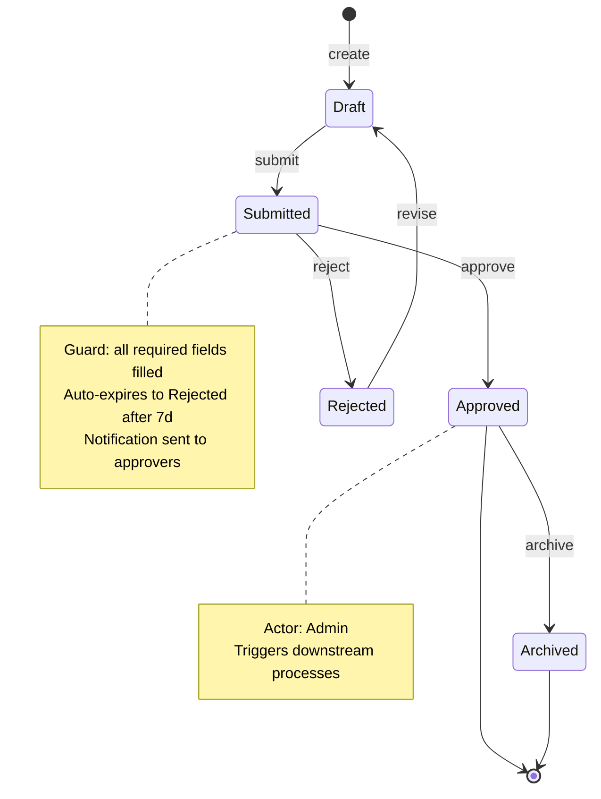
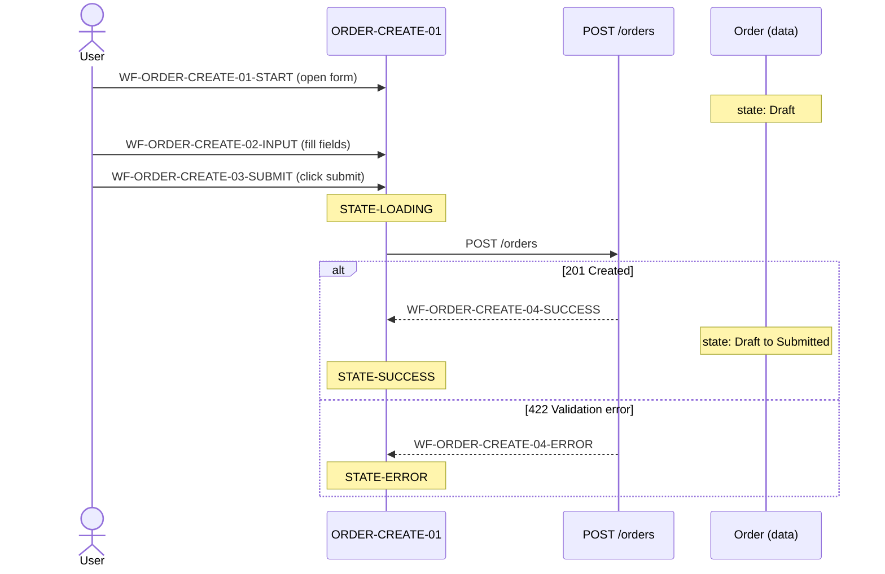
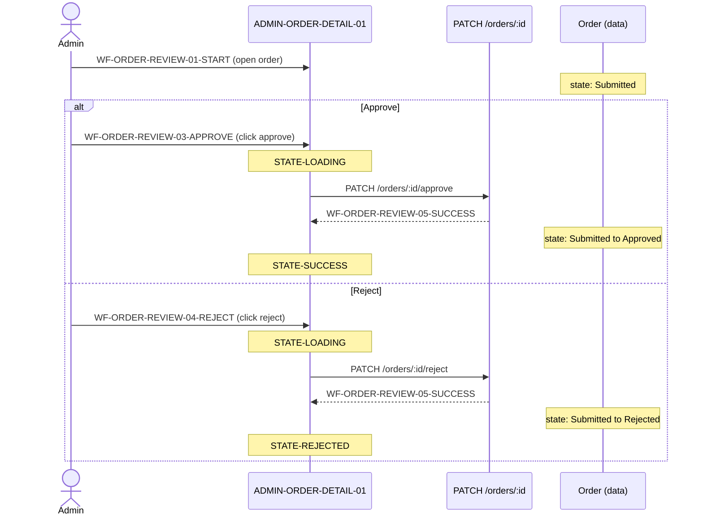
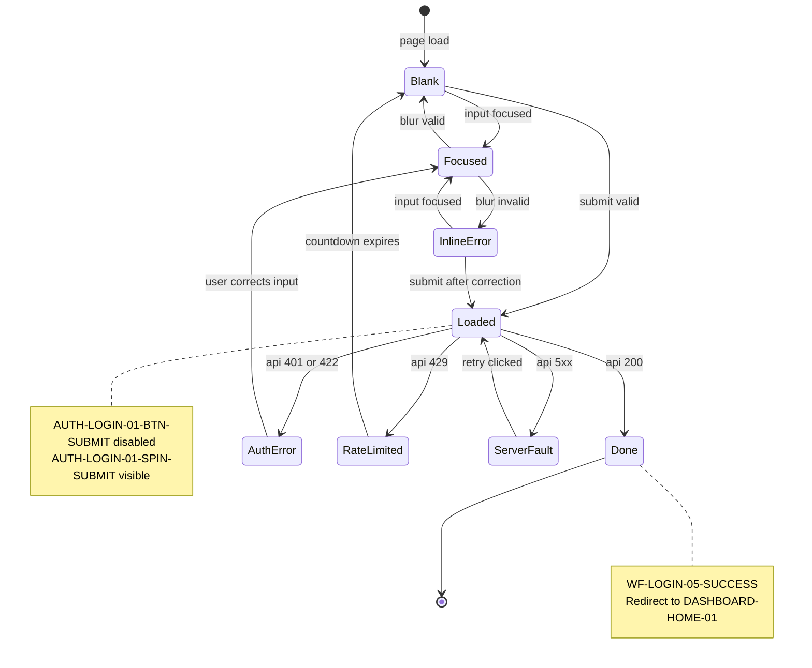
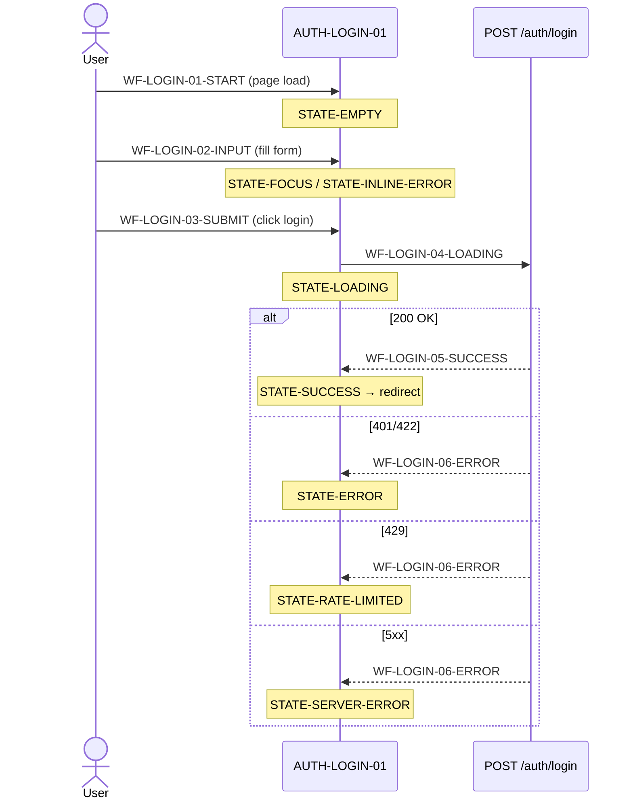

# State Diagram Generator (Data + UI)

Use this workflow after completing Step 10 (Object Life Cycle) and Step 16.2 (Wireframe Flow Requirements). It derives two complementary layers of state machines:

1. **Data State Machine** — entity lifecycle states from `docs/10-object-lifecycle.md`, enriched with the API triggers and guard conditions that drive transitions from the UX layer.
2. **UI State Machine** — per-screen visual states from `docs/ux-flow-reqs/` (Step 16.2), showing how each screen transitions between states in response to user actions and API responses.

Both layers are cross-linked so that a data transition (e.g., `Order: Draft → Submitted`) maps to the exact UI wireflow step that triggers it (e.g., `WF-ORDER-03-SUBMIT`).

## Usage

```
/aspec-16.3-state-diagram [input_files]
```

**Examples:**
- `/aspec-16.3-state-diagram docs/10-object-lifecycle.md docs/ux-flow-reqs/`
- `/aspec-16.3-state-diagram` (defaults to reading `docs/10-object-lifecycle.md` and all files in `docs/ux-flow-reqs/`)

## Input

```text
$ARGUMENTS
```

If `$ARGUMENTS` contains file paths or a directory, read those.
If empty, auto-load:
- `docs/10-object-lifecycle.md` — entity state machines (Step 10)
- `docs/ux-flow-reqs/*.md` — per-screen wireframe flow requirements (Step 16.2)
- `docs/16-ux-wireframes.md` — screen inventory and interaction patterns (Step 16)
- `docs/ux-flows/*.md` — per-page UX sub-flows (Step 16.1)
- `docs/14-api-design.md` — API endpoints (read if present)
- `docs/05-data-structure.md` — DTOs and validation rules (read if present)

## Prerequisites

Ensure you have completed:
- Object Life Cycle (Step 10 — `/aspec-10-object-lifecycle`)
- UX Wireframe Flow & UI Design (Step 16 — `/aspec-16-ux-design`)
- Per-Page UX Sub-Flow (Step 16.1 — `/aspec-16.1-ux-page-flow`)
- Wireframe Flow Requirements (Step 16.2 — `/aspec-16.2-ux-wireframe-flow-req`)

## Prompt

```
You are a systems analyst who bridges domain modeling and UX design. Your job is to read the Object Life Cycle document (Step 10) and the Wireframe Flow Requirements (Step 16.2) and produce two unified state machine diagrams per entity/screen pair:

1. A **Data State Machine** — the authoritative lifecycle of each domain entity, enriched with the UI triggers that cause transitions.
2. A **UI State Machine** — the visual state machine of each screen, enriched with the data transitions it drives.

Then produce a **Cross-Reference Matrix** that maps every data state transition to its corresponding UI wireflow step and screen state.

**Input Documents:**
- `docs/10-object-lifecycle.md` — entity states, transition rules, guard conditions, actors (Step 10)
- `docs/ux-flow-reqs/*.md` — Screen IDs, Component IDs, State IDs, Wireflow Step IDs, API Interaction Matrix (Step 16.2)
- `docs/16-ux-wireframes.md` — screen inventory, user flow diagrams, interaction patterns (Step 16)
- `docs/ux-flows/*.md` — per-page micro-flows, in-page state transitions (Step 16.1)
- `docs/14-api-design.md` — API endpoints, request/response, error codes (read if present)
- `docs/05-data-structure.md` — DTOs, enums, validation rules (read if present)

---

### Step-by-step Instructions

#### Phase 1: Extract Data States

1. Read `docs/10-object-lifecycle.md`. For each entity with a state machine:
   - Extract all states, transitions, triggers, guard conditions, and actors.
   - Note which API endpoints drive each transition (cross-reference `docs/14-api-design.md`).

2. For each entity, **save one file**:
   ```
   docs/state-diagrams/data/<EntityName>.md
   ```
   Each file must contain:
   - `stateDiagram-v2` — entity lifecycle states
   - `sequenceDiagram` (UI standpoint) — one diagram per user-initiated transition group, showing: User → Screen (STATE-LOADING) → API → data state change
   - State Definitions table
   - Transition Rules table
   - State-Specific Business Rules
   - Audit Trail table
   - UI Triggers table (cross-link to Step 16.2)

#### Phase 2: Extract UI States

3. Read all `docs/ux-flow-reqs/*.md` files. For each screen:
   - Extract the State Registry (all `<SCREEN_ID>-STATE-*` IDs).
   - Extract the Wireflow Specification (all `WF-*` step IDs).
   - Extract the API Interaction Matrix (which API call triggers which state transition).

4. For each screen, **save one file**:
   ```
   docs/state-diagrams/ui/<SCREEN_ID>.md
   ```

#### Phase 3: Cross-Link

5. Build a **Cross-Reference Matrix** that links:
   - Data entity state transition → API endpoint → UI wireflow step → UI screen state change.

6. Save the cross-reference as:
   ```
   docs/state-diagrams/cross-ref.md
   ```

7. Save the directory index as:
   ```
   docs/state-diagrams/README.md
   ```

---

### Output Format

#### File A: `docs/state-diagrams/data/<EntityName>.md` — one file per entity

```markdown
# Data State Machine: <EntityName>

**Source:** `docs/10-object-lifecycle.md`
**Entity:** <EntityName>
**Enum/Field:** `<entity>.status` (or equivalent field from `docs/05-data-structure.md`)

### State Diagram



### State Definitions

| State | Description | Entry Condition | Exit Condition | Allowed Actions | Actor(s) |
|-------|-------------|-----------------|----------------|-----------------|----------|
| Draft | Initial editable state | Object created | `submit()` called | edit, delete, submit | Owner |
| Submitted | Awaiting review | All required fields filled | approve/reject | cancel | Owner, Admin |
| Approved | Approved and active | Approver confirms | archive / (end) | archive | Admin |
| Rejected | Returned for revision | Approver rejects | revise | revise | Owner |
| Archived | Soft-deleted / historical | System or manual | — | restore (if supported) | Admin |

### Transition Rules

| From | To | Trigger | Guard Condition | API Endpoint | Actor | Side Effects |
|------|----|---------|-----------------|-------------|-------|--------------|
| Draft | Submitted | `submit()` | All required fields filled | `POST /orders` | Owner | Notify approvers |
| Submitted | Approved | `approve()` | Actor has `ADMIN` role | `PATCH /orders/:id/approve` | Admin | Notify owner |
| Submitted | Rejected | `reject()` | Actor has `ADMIN` role | `PATCH /orders/:id/reject` | Admin | Notify owner, reason required |
| Rejected | Draft | `revise()` | Actor is owner | `PATCH /orders/:id` | Owner | Reset rejection reason |
| Approved | Archived | `archive()` | System timer or manual | `DELETE /orders/:id` (soft) | System/Admin | Audit log entry |

### State-Specific Business Rules

```
State: Submitted
- Cannot be edited by owner while pending
- Auto-expires to Rejected after 7 days (system job)
- Notification sent to all Admins on entry

State: Approved
- Read-only for all actors
- Triggers downstream processes (e.g., fulfillment)
```

### Audit Trail

| Transition | Log? | Captured Fields |
|-----------|------|-----------------|
| Draft → Submitted | ✅ | actor_id, timestamp, snapshot |
| Submitted → Approved | ✅ | actor_id, timestamp, note |
| Submitted → Rejected | ✅ | actor_id, timestamp, reason |
| Rejected → Draft | ✅ | actor_id, timestamp |
| Approved → Archived | ✅ | actor_id, timestamp, method (manual/auto) |

### UI Sequence (from UI standpoint)

Shows how each data state transition is triggered from the user's perspective: User action → Screen state → API call → data state change.





### UI Triggers (Cross-Link to Step 16.2)

| Data Transition | Triggered By Wireflow Step | Screen | UI Component |
|----------------|---------------------------|--------|--------------|
| Draft → Submitted | `WF-ORDER-CREATE-03-SUBMIT` | `ORDER-CREATE-01` | `ORDER-CREATE-01-BTN-SUBMIT` |
| Submitted → Approved | `WF-ORDER-REVIEW-03-APPROVE` | `ADMIN-ORDER-DETAIL-01` | `ADMIN-ORDER-DETAIL-01-BTN-APPROVE` |
| Submitted → Rejected | `WF-ORDER-REVIEW-04-REJECT` | `ADMIN-ORDER-DETAIL-01` | `ADMIN-ORDER-DETAIL-01-BTN-REJECT` |
```

---

#### File B: `docs/state-diagrams/ui/<SCREEN_ID>.md` — one file per screen

```markdown
# UI State Machine: <Screen Name> (`<SCREEN_ID>`)

**Source:** `docs/ux-flow-reqs/<SCREEN_ID>.md`
**Route:** `/<route>`
**Access:** Public / Auth / Auth+Admin

### State Diagram



### State Definitions

| State ID | State Name | Trigger | What User Sees | Wireflow Step | Data Transition Triggered |
|----------|-----------|---------|----------------|---------------|--------------------------|
| `AUTH-LOGIN-01-STATE-EMPTY` | Empty | Page load | Empty form, button enabled | `WF-LOGIN-01-START` | — |
| `AUTH-LOGIN-01-STATE-FOCUS` | Focus | Input focused | Blue border on active input | `WF-LOGIN-02-INPUT` | — |
| `AUTH-LOGIN-01-STATE-INLINE-ERROR` | Inline Error | Blur with invalid value | Red border + error text | `WF-LOGIN-02-INPUT` | — |
| `AUTH-LOGIN-01-STATE-LOADING` | Loading | Submit clicked | Spinner, inputs disabled | `WF-LOGIN-04-LOADING` | — |
| `AUTH-LOGIN-01-STATE-SUCCESS` | Success | API 200 | Fade + redirect | `WF-LOGIN-05-SUCCESS` | `Session: None → Active` |
| `AUTH-LOGIN-01-STATE-ERROR` | API Error | API 401/422 | Red alert banner | `WF-LOGIN-06-ERROR` | — |
| `AUTH-LOGIN-01-STATE-RATE-LIMITED` | Rate Limited | API 429 | Countdown timer, button disabled | `WF-LOGIN-06-ERROR` | — |
| `AUTH-LOGIN-01-STATE-SERVER-ERROR` | Server Error | API 5xx | Generic error + retry | `WF-LOGIN-06-ERROR` | — |

### Wireflow Step Sequence



### State Transition Matrix

| From State ID | To State ID | Trigger | Wireflow Step | API Call |
|--------------|------------|---------|---------------|----------|
| `...-STATE-EMPTY` | `...-STATE-FOCUS` | Input focus | `WF-LOGIN-02-INPUT` | — |
| `...-STATE-FOCUS` | `...-STATE-EMPTY` | Blur (valid) | `WF-LOGIN-02-INPUT` | — |
| `...-STATE-FOCUS` | `...-STATE-INLINE-ERROR` | Blur (invalid) | `WF-LOGIN-02-INPUT` | — |
| `...-STATE-EMPTY` | `...-STATE-LOADING` | Submit (valid) | `WF-LOGIN-03-SUBMIT` | `POST /auth/login` |
| `...-STATE-LOADING` | `...-STATE-SUCCESS` | 200 OK | `WF-LOGIN-05-SUCCESS` | — |
| `...-STATE-LOADING` | `...-STATE-ERROR` | 401/422 | `WF-LOGIN-06-ERROR` | — |
| `...-STATE-LOADING` | `...-STATE-RATE-LIMITED` | 429 | `WF-LOGIN-06-ERROR` | — |
| `...-STATE-LOADING` | `...-STATE-SERVER-ERROR` | 5xx | `WF-LOGIN-06-ERROR` | — |
| `...-STATE-ERROR` | `...-STATE-FOCUS` | Input focus | `WF-LOGIN-02-INPUT` | — |
| `...-STATE-RATE-LIMITED` | `...-STATE-EMPTY` | Timer expires | — | — |
| `...-STATE-SERVER-ERROR` | `...-STATE-LOADING` | Retry click | `WF-LOGIN-03-SUBMIT` | `POST /auth/login` |

### Data Transitions Triggered by This Screen

| UI Action | Wireflow Step | API Endpoint | Data Entity | Data Transition |
|-----------|--------------|-------------|-------------|-----------------|
| Login submit | `WF-LOGIN-03-SUBMIT` | `POST /auth/login` | Session | `None → Active` |

---

#### File C: `docs/state-diagrams/cross-ref.md` — single cross-reference file

```markdown
# Cross-Reference Matrix: Data ↔ UI

This matrix is the authoritative link between domain state machines (Step 10) and UI state machines (Step 16.2).

| Data Entity | Data Transition | Guard Condition | API Endpoint | Screen ID | Wireflow Step | UI State Before | UI State After |
|-------------|----------------|-----------------|-------------|-----------|--------------|-----------------|----------------|
| Session | None → Active | Valid credentials | `POST /auth/login` | `AUTH-LOGIN-01` | `WF-LOGIN-03-SUBMIT` | `STATE-LOADING` | `STATE-SUCCESS` |
| Session | Active → None | User logs out | `POST /auth/logout` | `DASHBOARD-HOME-01` | `WF-LOGOUT-02-CONFIRM` | `STATE-LOADED` | `STATE-EMPTY` |
| Order | Draft → Submitted | All fields valid | `POST /orders` | `ORDER-CREATE-01` | `WF-ORDER-CREATE-03-SUBMIT` | `STATE-LOADING` | `STATE-SUCCESS` |
| Order | Submitted → Approved | Admin confirms | `PATCH /orders/:id/approve` | `ADMIN-ORDER-DETAIL-01` | `WF-ORDER-REVIEW-03-APPROVE` | `STATE-LOADING` | `STATE-SUCCESS` |
| Order | Submitted → Rejected | Admin rejects | `PATCH /orders/:id/reject` | `ADMIN-ORDER-DETAIL-01` | `WF-ORDER-REVIEW-04-REJECT` | `STATE-LOADING` | `STATE-REJECTED` |

### Orphan Check

After building the matrix, verify:
- **Unlinked data transitions**: Data transitions with no corresponding UI wireflow step (may be system/background jobs — document explicitly).
- **Unlinked UI states**: UI states that trigger no data transition (pure UI states like FOCUS, INLINE-ERROR — expected and valid).
- **Missing LOADING steps**: Every API call in the matrix MUST have a corresponding `STATE-LOADING` UI state. Flag any gap.
```

---

#### File D: `docs/state-diagrams/README.md` — directory index

```markdown
# State Diagrams Index

Generated by `/aspec-16.3-state-diagram`. Cross-links Step 10 (Object Lifecycle) with Step 16.2 (Wireframe Flow Requirements).

## Data State Machines

| Entity | File | States | Transitions |
|--------|------|--------|-------------|
| Order | [Order.md](data/Order.md) | 5 | 5 |
| Session | [Session.md](data/Session.md) | 2 | 2 |
| ... | ... | ... | ... |

## UI State Machines

| Screen ID | Screen Name | File | States | Wireflow Steps |
|-----------|-------------|------|--------|----------------|
| AUTH-LOGIN-01 | Login | [AUTH-LOGIN-01.md](ui/AUTH-LOGIN-01.md) | 8 | 6 |
| DASHBOARD-HOME-01 | Dashboard | [DASHBOARD-HOME-01.md](ui/DASHBOARD-HOME-01.md) | 4 | 5 |
| ... | ... | ... | ... | ... |

## Cross-Reference

See [cross-ref.md](cross-ref.md) for the full Data ↔ UI transition mapping and orphan check.
```

---

### Guidelines

1. **One Data State Machine per entity** — derive directly from Step 10. Do not invent new entity states; only enrich with UI trigger cross-links.
2. **One UI State Machine per screen** — derive directly from Step 16.2 State Registry and Wireflow Specification. Do not invent new UI states.
3. **Mermaid `stateDiagram-v2` for state machines** — use for both data and UI state diagrams. Use `note` blocks to annotate key states.
4. **Mermaid `sequenceDiagram` for wireflow steps** — use to show the temporal sequence of user actions, screen state changes, and API calls for each screen.
5. **Every API call must appear in both layers** — in the data layer as a transition trigger, and in the UI layer as a LOADING → SUCCESS/ERROR transition.
6. **Guard conditions are mandatory** — every transition arrow must include its guard condition (in `[]` notation in Mermaid or in the transition table).
7. **Cross-Reference Matrix is mandatory** — every data transition that is user-initiated must appear in the matrix with its corresponding screen and wireflow step.
8. **System/background transitions** — data transitions triggered by system jobs (timers, cron, webhooks) must be documented in the matrix with `Screen ID = SYSTEM` and `Wireflow Step = SYSTEM-JOB`.
9. **Naming consistency** — use the exact State IDs from Step 16.2 (`<SCREEN_ID>-STATE-<NAME>`) and exact Wireflow Step IDs (`WF-<FLOW>-<STEP>-<ACTION>`). Never use bare names.
10. **Parallel states** — if an entity or screen has parallel/concurrent states (e.g., a screen that is both LOADING and has a visible sidebar), use Mermaid `stateDiagram-v2` parallel state syntax (`--`).
11. **UI Sequence diagram in data files** — every `data/<Entity>.md` file must include a `sequenceDiagram` section titled "UI Sequence (from UI standpoint)". Group transitions by actor (e.g., one diagram for Owner actions, one for Admin actions). Each diagram must show: `actor → Screen (with STATE-LOADING note) → API call → Note over Entity: state change`. System/background transitions (no UI actor) use `participant System` instead of `actor`. Never skip the LOADING step for any API call.
12. **Mermaid transition label syntax — NO special characters** — `stateDiagram-v2` transition labels must use plain text only. Never use `()`, `/`, `>`, `<`, `→`, `->`, or any other special characters in transition labels. They will cause parse errors. Use plain verb phrases instead. For terminal transitions (`State --> [*]`), omit the label entirely.
    ```
    ✅ CORRECT
        Draft --> Submitted : submit
        Submitted --> Approved : approve
        Approved --> [*]

    ❌ WRONG
        Draft --> Submitted : submit()
        Submitted --> Approved : approve() [actor: Admin]
        Draft --> Submitted : None → Active
        Approved --> [*] : end
    ```
    Guard conditions and actor notes belong in the **Transition Rules table**, not in the Mermaid label.
13. **Mermaid `stateDiagram-v2` reserved keywords — NEVER use as state identifiers** — the following words are reserved by Mermaid's parser and will cause render failures if used as state node names. Rename them to a descriptive alternative:
    | Reserved / risky word | Use instead |
    |-----------------------|-------------|
    | `Default` | `Loaded`, `Normal`, `Standard` |
    | `Empty` | `Blank`, `NoData`, `NoReplies`, `Initial` |
    | `Error` | `LoadError`, `AuthError`, `Failed`, `Faulted` |
    | `Loading` | `Loaded`, `Fetching`, `Pending` |
    | `Success` | `Done`, `Completed`, `Confirmed` |
    | `Focus` | `Focused`, `Active`, `Editing` |
    | `State` | `EntityState`, `CurrentState` |
    | `Note` | `Remark`, `Annotation` |
    | `End` | `Terminal`, `Closed`, `Finished` |
    | `Start` | `Begin`, `Init` |
    | `Fork` | `Split` |
    | `Join` | `Merge` |
    | `Choice` | `Decision` |
    | `ParentDeleted` | `ParentGone`, `OrphanState` |
    | `EmptyResults` | `NoMatches`, `NoResults` |
    | `SERVER_ERROR` / `ServerError` | `ServerFault`, `Unavailable` |
    | `API_ERROR` / `ApiError` | `AuthError`, `RequestFailed` |
    When in doubt, prefix the state name with the entity or screen ID (e.g., `ORDER_BLANK` instead of `Empty`, `LOGIN_DONE` instead of `Success`) to guarantee uniqueness and avoid all reserved word conflicts.
```

## Output

Save all generated files under `docs/state-diagrams/` in your project. **Do not produce a single monolithic file.** Generate each file separately so each is small and focused.

```
docs/state-diagrams/
├── README.md                        # Index: lists all entities and screens with links
├── cross-ref.md                     # Cross-Reference Matrix: Data ↔ UI + orphan check
├── data/
│   ├── <EntityA>.md                 # One file per domain entity (from Step 10)
│   ├── <EntityB>.md
│   └── ...                          # e.g. Order.md, Session.md, User.md
└── ui/
    ├── <SCREEN_ID_1>.md             # One file per screen (from Step 16.2)
    ├── <SCREEN_ID_2>.md
    └── ...                          # e.g. AUTH-LOGIN-01.md, DASHBOARD-HOME-01.md
```

**File size targets:**
- `data/<Entity>.md` — ~50–120 lines (state diagram + 3 tables)
- `ui/<SCREEN_ID>.md` — ~80–150 lines (state diagram + sequence diagram + 3 tables)
- `cross-ref.md` — ~30–80 lines (one table + orphan check)
- `README.md` — ~30–50 lines (two index tables + links)

## Next Steps

After completing this step, proceed to:
- `/aspec-17-plan` - Generate Project Scope and Phase Plan (Step 17)
- `/aspec-19-testplan` - Use State IDs and Wireflow Step IDs as test case anchors (Step 19)
- `/aspec-20-implement` - Use state diagrams to implement state management (useState/Zustand/XState) with correct state variable names matching State IDs (Step 20)
